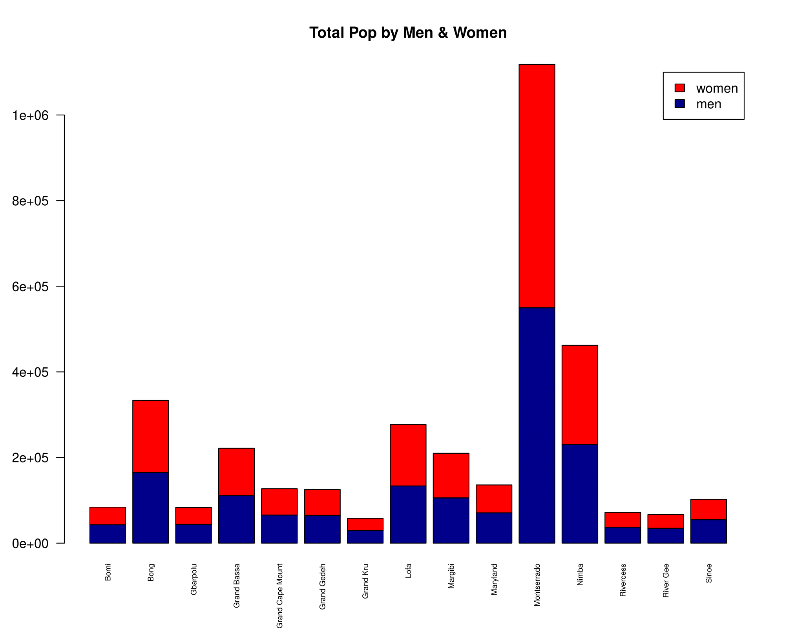
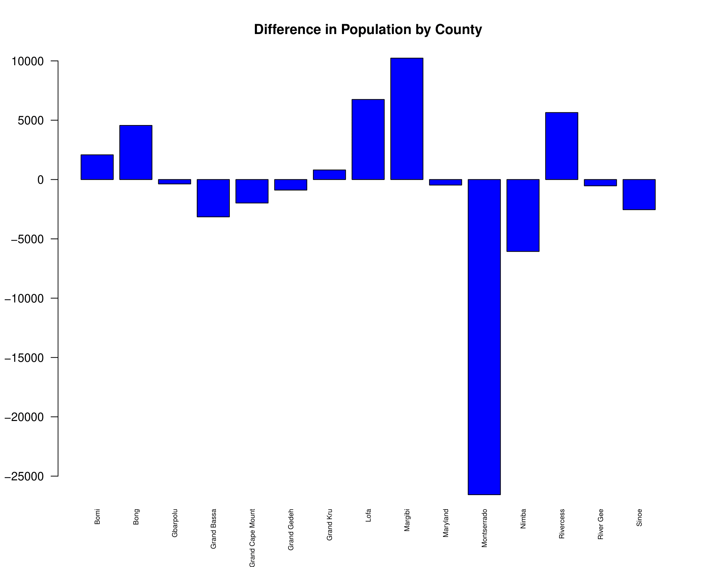
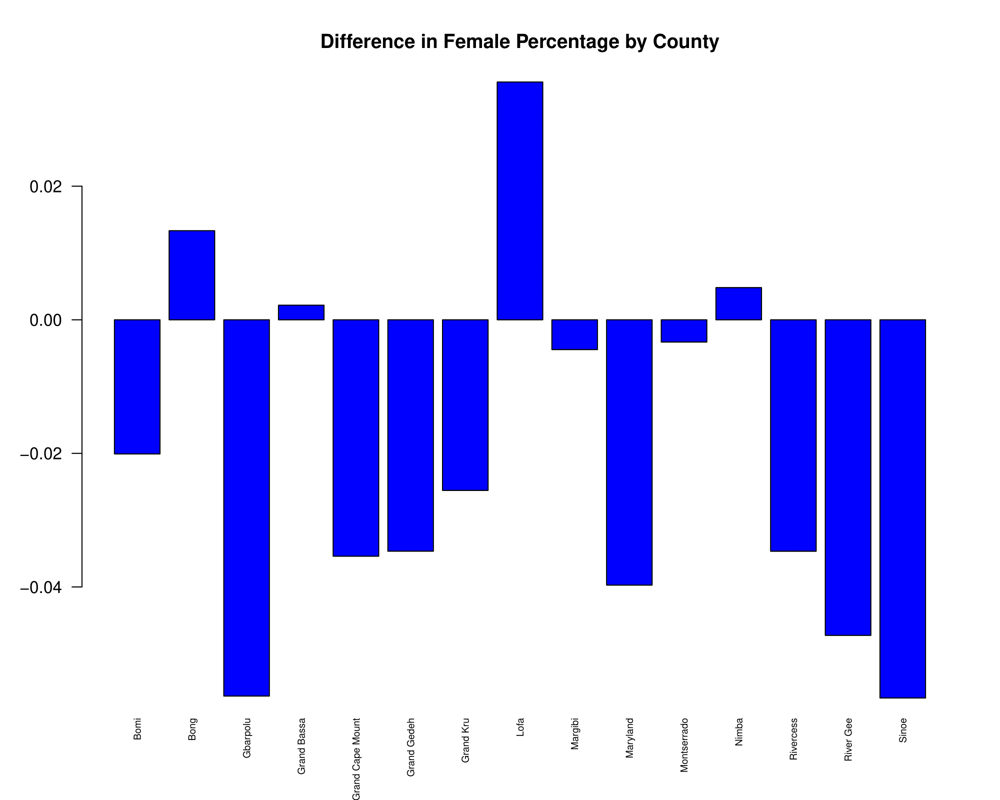

# Data Management Basics Lab pt. 1
These are various plots comparing data about various Liberian Counties.

# Data Used:
[Liberian County Data](data_lab_1.txt)

# Total Population of Each County, Including Indication of Male and Female Counts:

This stacked bar graph compares the population of males versus females in each Liberian country, where men are represented by blue, and women are represented by red in the bar graph.

# Difference in Total Population Between Source and Remote Population Datasets:. 

This bar graph analyzes the difference of men and women in each Liberian County by subtracting the total population of females from males in each county, and graphing the difference. 

# Difference in Percent Female Between Source and Remote Population Datasets:

This bar graph analyzes the difference in percentage of females per county between the source and remote population data sets.

# Population Density of Each County:

This bar graph analyzes the population density of the total population in each Liberian County.
