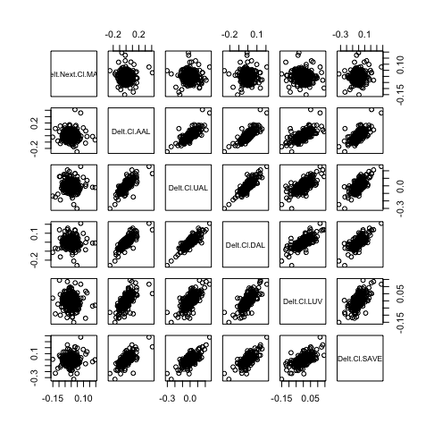

# Data Management Basics Lab 2 Part 2

[Summary of statistical model](model_mar3.txt)

# Stock Prediction Correlation Matrix

This correlation matrix describes the relationship between Marriott stock with American Airlines, United Airlines, Delta Airlines, Southwest Airlines, and Spirit Airlines stock. I selected airlines as my predictor stocks because I believed there was a direct relationship between the success of airline companies and one of the largest hotel companies, especially during COVID-19. 

