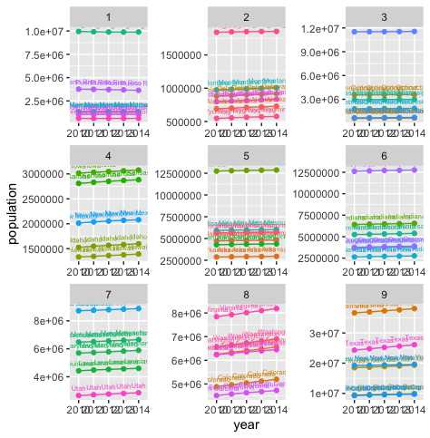
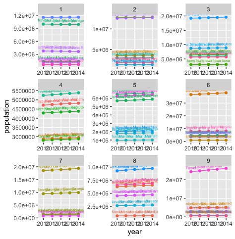

# Data Management Basics Lab 2 Part 1

# Absolute Population Increase 2010 - 2014

This graph depict the absolute population increase of the 52 primary subdivisions within the United States in nine quantiles from 2010 - 2014.

# Average Annual Growth Rate 2010 - 2014

This graph depict the average annual growth rate of the 52 primary subdivisions within the United States in nine quantiles from 2010 - 2014.
