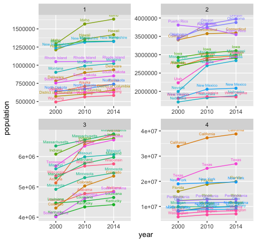

# Data Management Basics Lab pt. 3

# Population Growth of Each State from 2000 - 2014

These four line graphs indicate the population growth from 2000 - 2014 of the 50 states of the United States, as well as Puerto Rico. The data is divided into four graphs, separated by the four different quantiles of total population of each state relative to one another. Information obtained from the Census Bureau. 
