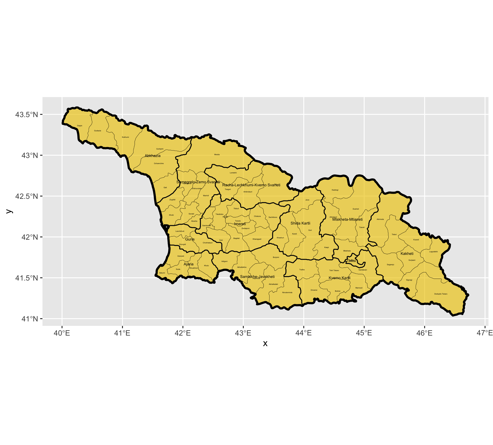
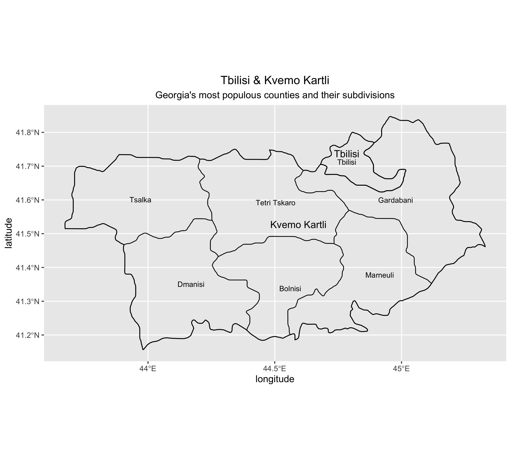
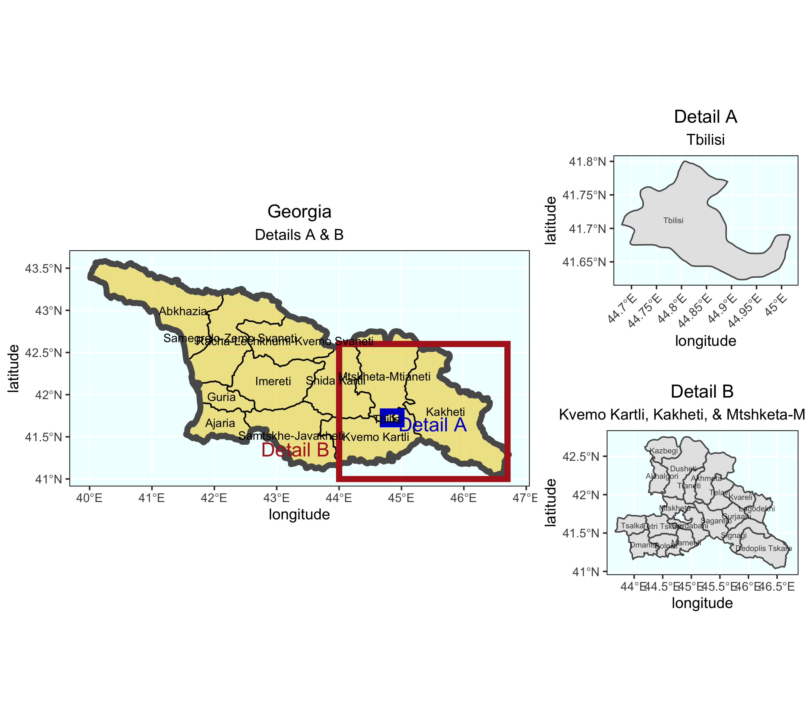

# Data Management Basics Lab 3 

# Deliverable 1 - Plot of Georgia

This deliverable utilizes spatial data from GADM by creating a plot of Georgia. The thickest black border surrounds the largest administrative district in Georgia, the whole state. The medium thickness border divides Georgia into administrative districts. The thinnest border divides Georgia into subdivisions within the administrative districts.

# Stretch Goal 2 - Plot of Tbilisi & Kvemo Kartli

This stretch goal also utilizies spatial data from GADM by plotting the regions of Tbilisi and Kvemo Kartli. Tbilisi is the largest administrative district in Georgia, and Kvemo Kartli is the fourth biggest. The plot created depicts the two administrative districts as well as the subdivisions with Kvemo Kartli. Tbilisi is both an administrative district, and its only subdivison.

# Stretch Goal 3 - Detailed Plot of Tbilisi, Kvemo Kartli, Kakheti, and Mtshketa-Mtianeti

Finally, this stretch goal also utilizies spatial data from GADM by plotting all of Georgia, with a rectangular box highlighting two details within Georgia, with subsequent smaller plots showing greater detail to the emphasized area. Detail A highlights Tbilisi, while Detail B depicts Kvemo Kartli, Kakheti, and Mtshketa-Mtianeti. 
