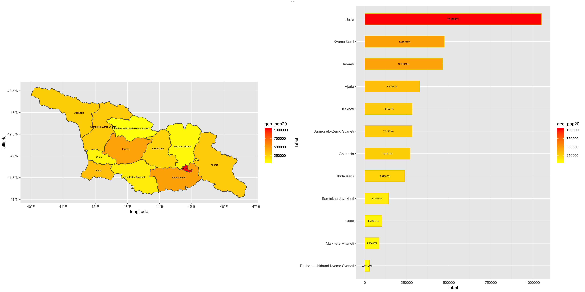

# Data Management Basics Lab 4 Pt. 2

# Plots of Georgia's Population Density

The following plots depict Georgia's population density in two formats. The plot on the left depicts a graphical representation of Georgia, with the yellow regions having a lower population density, and the redder regions having a higher population density. The plot on the right depicts a numerical representation of Georgia's population density, ordered from highest to lowest among Georgia's adm1s. 
