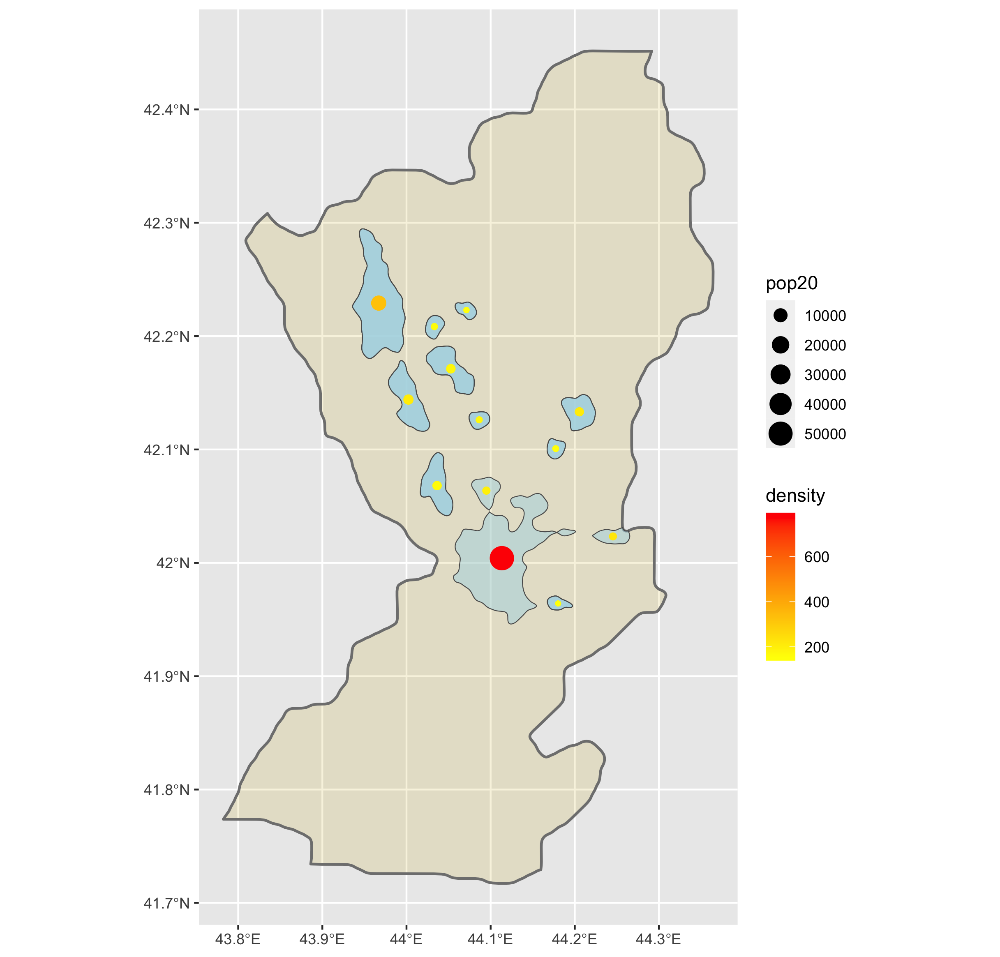
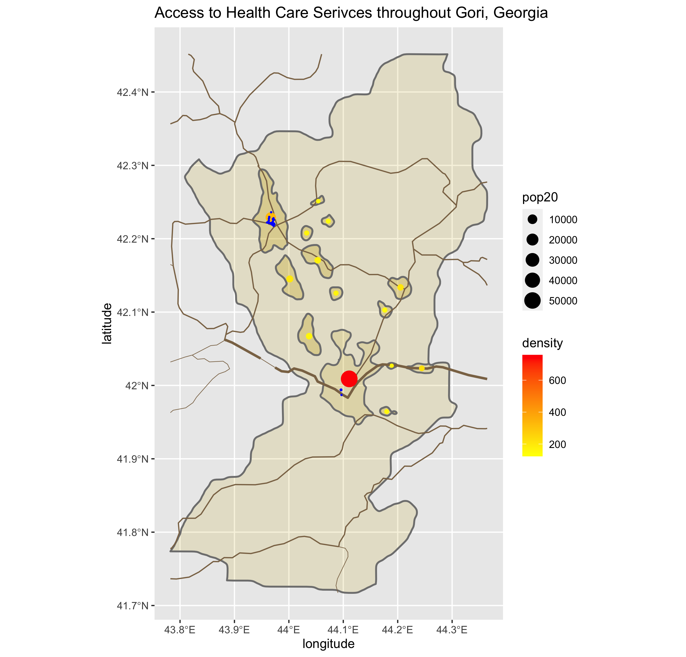
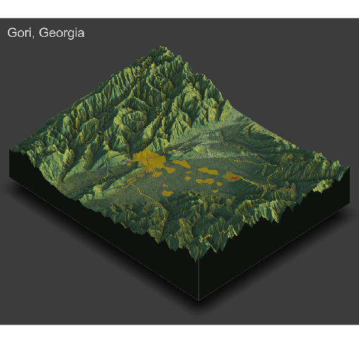

# Final Project

# Accessibility 1 Deliverable

In this deliverable, I analyzed the Gori Municipality within Georgia in order to find the de facto location of human settlements and urban areas. I found the population density of the region, and plotted my estimate where I believe potential urban areas would lie. The bigger a circle is on the plot, the more people that reside there, and the circles are shaded in from yellow (representing a low population density) to red (representing a high population density). I concluded from this deliverable that there is one major high density urban area, one medium density area, and approximately 11 low density urban areas in the region. This is relatively close to the truth, as in reality, Gori has two main cities, Gori and Tskhinvali, both of which I was able to successfully deduce from my plot. 

# Accessibility 2 Deliverable

In this deliverable, I analyzed the Gori Municipality within Georgia to determine the de facto location of human settlements and urban areas, the center lines of classified roadways and the location of health care facilities by type. Upon completion of the deliverabele, I was able to conclude that the total population of the Gori Municipality is approximately 150,000 people. My conclusion from deliverable one was also confirmed by this deliverable (question two was answered in my first conclusion). I found that in the region, there was one primary roadway cutting across the region that also passes by the largest urban area in the Gori Municaplity. I also found secondary and tertiary roadways connecting many of the smaller urban areas together, and ultimately connecting Gori to Tshinavali. I estimate that the infrastructure in the Gori Municpality is realtively poor, and that the only primary road in the region is there for the purpose of interstate travel, rather than intrastate. The remaining intrastate roadways are mainly teritary roads with some secondary roads, all of which connect the smaller urban areas together. Finally, I have concluded that the health care access in the Gori Municpality is also poor. In the region, there is only one hospital, one dentist, one clinic, and 21 pharmacies. This is concerning because for a population of 150,000 people, that seems like a relatively low amount of health care facilities. Another concern is that besides the one clinic and pharmacy in Gori, the remainder of all health care facilities are in Tshinavali. This leaves the people outside of these urban centers without quick access to health care. This fear is also exacerbated by the lack of major roads connecting the smaller urban areas to Gori and Tshinavali. 

# Accessibility 3 Deliverable

In this deliverable, I analyzed the Gori Municipality within Georgia in order to create a three-dimensional, topographic plot that describes the de facto boundaries of urban areas, the center lines of classified roadways and the location of health care facilities by type in the region. Upon completion, I determined that topography has impacted the development of urban areas in Gori since all urban areas in the Municpality are located in the flatlands of Gori, which are surrounded by mountains. Presumably, the people of Georgia didn't want to build their cities in the mountains, so they built all of their urban areas in the large valley between the two sets of mountain ranges. The topography has also influenced the development of transportation facilities as the only primary roadway and the majority of the secondary roadways are located in the flat parts of Gori, rather than in the mountains. Instead, the mountain ranges mainly consist of the tertiary roadways of Georgia, since it is harder to build larger infrastructure projects in mountainous terrain. Due to this topography, the health care facilities are only focused in the two main urban areas since it is easier to build these facilities in locations that already have some infrastructure. Building a clinic from scratch in a mountainous area is a lot harder than building one in an already developed city. Finally, producing a three-dimensional map resulted in an interpretion that is different from your previous analysis because seeing the effects the mountains have on development in the region is important to consider when analyzing why infrastructure is stronger in some areas, and weaker in others. The three-dimensional map allows me to better justify the locations of the health care and transportation facilities as well as the locations of urban areas.

