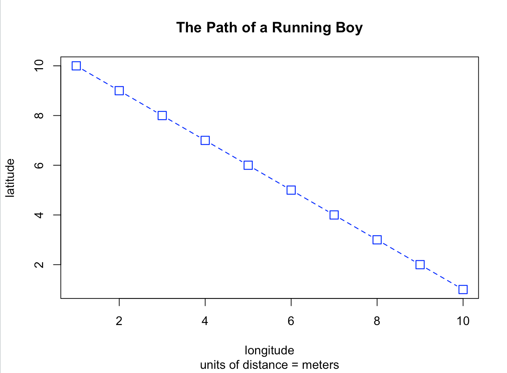
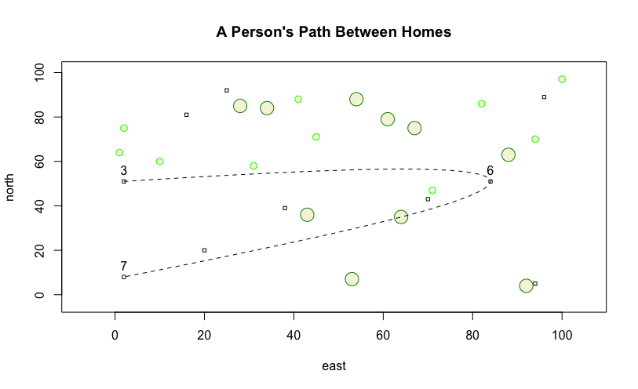
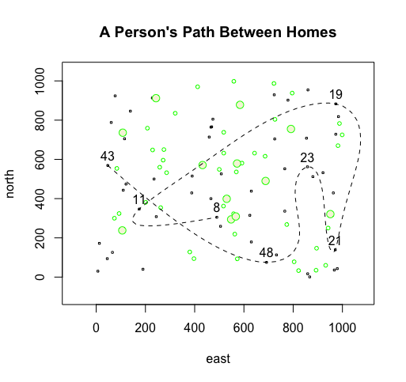

# First Set of Practices for R-Studio

These are various plots created in R-Studio as directed by "Getting Started with GitHub"

# Path of a Running Boy

# Path Between Homes

# Challenge Question

